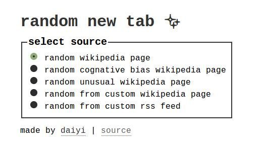

# random wikipedia newtab
Firefox extension that redirects to a random wikipedia page when you open a new tab, because when you're opening a new tab you're looking for a distraction and that distraction might as well be a weird fact

### this is the way I'm developing extensions although you can certainly do it without npm

1. install npm

2. install web-ext: `npm install --global web-ext`

3. run in project folder: `web-ext run`

4. navigate to `about:addons` in the firefox window that opens. click extensions. it's installed :D extension will auto update as you save files in the project.

5. navigate to `about:debugging`, make sure `Enable add-on debugging` is checked, and click `debug` next to the extension name. that's how you [debug the extension](https://developer.mozilla.org/en-US/Add-ons/Add-on_Debugger).

### notes

oh geez firefox extension development is a wasteland ):

cool stuff I found while trying to do the least work possible to scrape wikipedia pages:

- wiki api supports [parsing](https://www.mediawiki.org/wiki/API:Parsing_wikitext) :D
- wiki api [sandbox](https://www.mediawiki.org/wiki/Special:ApiSandbox)!  which I used to navigate the cumbersome wiki api
- [nice](https://en.wikipedia.org/w/api.php?action=query&titles=List_of_cognitive_biases&format=json&prop=links&pllimit=10000)

other notes

- `web-ext run` will watch for changes and reload. if you're working on extension options_ui page it kills it. if that's the only tab open it will kill the browser and end the `web-ext run` process. not sure the best workflow to deal with this but I've had `about:addons` opened in the other tab to easily open up the extension ui after it closes while refreshing

### todo

- escape custom wiki page chars
- tests
- icons
- filter wiki links by ns
